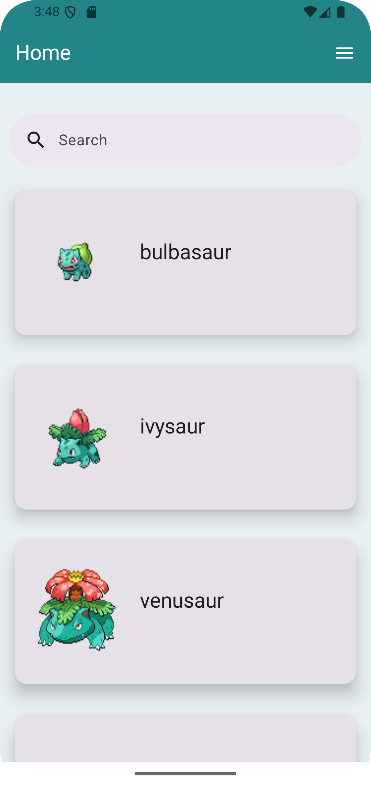
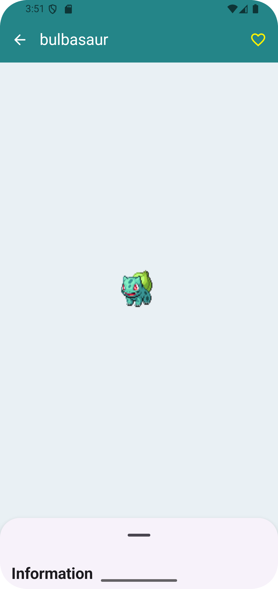
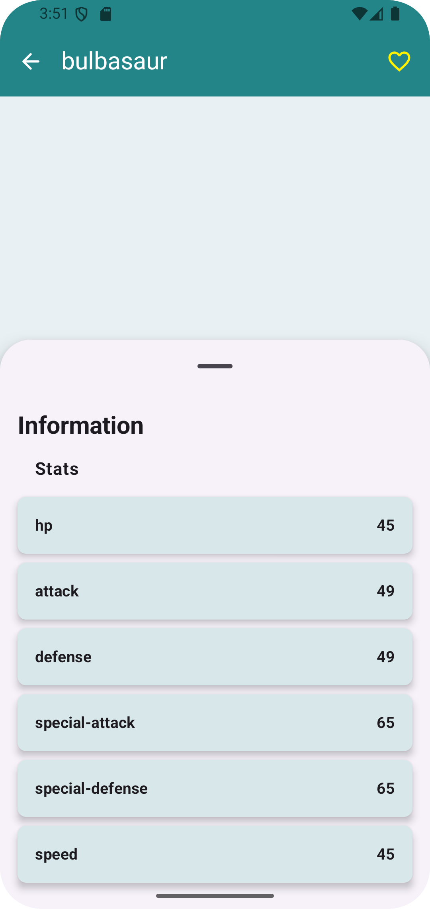
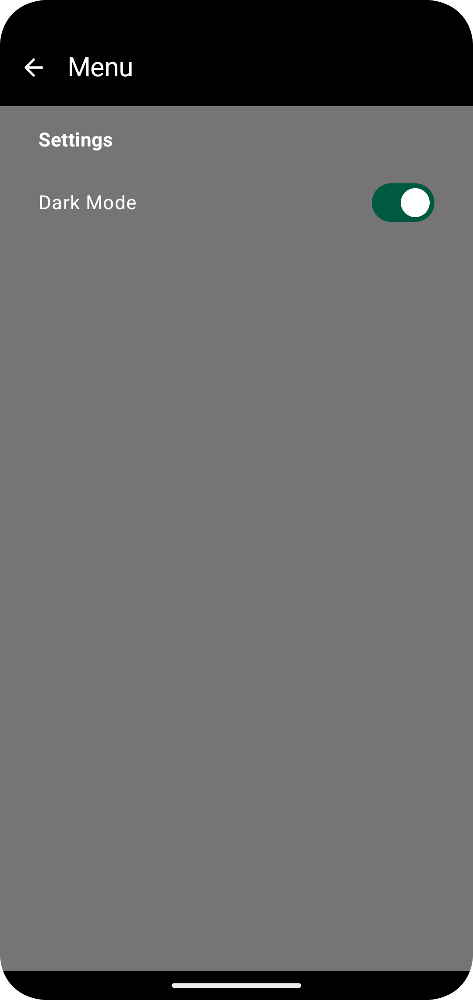

# BattleBase 🎮

A modern Android application built with Jetpack Compose that allows users to browse and manage Pokémon data. The app features a clean architecture design pattern with support for local caching and a beautiful Material 3 UI.

## 📱 Features

- Browse Pokémon with detailed information (stats, abilities)
- Mark Pokémon as favorites
- Dark/Light theme support
- Offline-first architecture with Room database
- Clean and intuitive Material 3 UI
- Edge-to-edge display support

## 🏗️ Architecture

This project follows Clean Architecture principles with a modular approach:

```
app/
├── common/                 # Shared components and utilities
├── features/              # Feature modules
│   ├── home/             # Pokémon browsing feature
│   │   ├── data/         # Data layer (repositories, data sources)
│   │   ├── domain/       # Business logic (use cases, models)
│   │   └── presentation/ # UI layer (ViewModels, Composables)
│   └── menu/             # Menu feature
└── composeUiLib/         # Reusable Compose UI components
```

### Architecture Layers

- **Presentation Layer**: Jetpack Compose UI with ViewModels
- **Domain Layer**: Use cases and business models
- **Data Layer**: Repositories, local (Room) and remote (Retrofit) data sources

## 🛠️ Tech Stack

### Core
- **Kotlin** - Primary programming language
- **Jetpack Compose** - Modern declarative UI toolkit
- **Material 3** - Latest Material Design components
- **Navigation 3** - Type-safe navigation

### Dependency Injection
- **Koin** - Lightweight dependency injection framework

### Networking
- **Retrofit** - REST API client
- **OkHttp** - HTTP client
- **Gson** - JSON serialization

### Database
- **Room** - Local database with SQLite
- **DataStore** - Key-value storage for preferences

### Image Loading
- **Coil 3** - Image loading library with Compose integration

### Testing
- **JUnit 5** - Unit testing framework
- **MockK** - Mocking library for Kotlin
- **Coroutines Test** - Testing coroutines

### Build & Tools
- **KSP** - Kotlin Symbol Processing for Room
- **Gradle Version Catalogs** - Centralized dependency management

## 📋 Prerequisites

- Android Studio Ladybug | 2024.2.1 or later
- JDK 11 or higher
- Android SDK 36
- Minimum Android API 24 (Android 7.0)

## 🚀 Getting Started

### 1. Clone the repository

```bash
git clone https://github.com/yourusername/BattleBase.git
cd BattleBase
```

### 2. Open in Android Studio

- Open Android Studio
- Select "Open an Existing Project"
- Navigate to the cloned repository
- Wait for Gradle sync to complete

### 3. Build and Run

- Connect an Android device or start an emulator
- Click the "Run" button or press `Shift + F10`
- Select your device and wait for the app to install

## 🧪 Running Tests

### Unit Tests

Run all unit tests from the command line:

```bash
./gradlew test
```

Or run tests for a specific module:

```bash
./gradlew :app:testDebugUnitTest
```

### Instrumented Tests

```bash
./gradlew connectedAndroidTest
```

## 📦 Modules

### app
Main application module containing features and business logic.

### composeUiLib
Reusable Compose UI components library including:
- Loading indicators
- Custom UI components
- Common composables

## 🌐 API

This app uses the [PokéAPI](https://pokeapi.co/) to fetch Pokémon data.

## 📄 License

This project is licensed under the MIT License - see the [LICENSE](LICENSE) file for details.

## 👤 Author

**Cfisher**

## 🤝 Contributing

Contributions, issues, and feature requests are welcome!

1. Fork the project
2. Create your feature branch (`git checkout -b feature/AmazingFeature`)
3. Commit your changes (`git commit -m 'Add some AmazingFeature'`)
4. Push to the branch (`git push origin feature/AmazingFeature`)
5. Open a Pull Request

## 📝 Notes

- The app requires an internet connection for initial data fetch
- Pokémon data is cached locally for offline access
- Dark theme preference is saved and persists across app restarts

## 🐛 Known Issues

- UI tooling dependency may need to be added for preview support in debug builds

## 📱 Screenshots

<div align="center">
  <table>
    <tr>
      <td align="center">
        
        <br />
        Home Screen
      </td>
        <td align="center">
        
        <br />
        Home Screen
      </td>
      <td align="center">
        
        <br />
        Details Screen
      </td>
      <td align="center">
        
        <br />
        Search Screen
      </td>
    </tr>
  </table>
</div>

---

**Built with ❤️ using Jetpack Compose**

